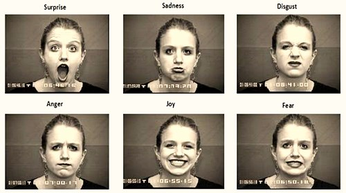

# Análisisd de sentimientos a partir de imágenes
En este repositorio se encontrara el desarrollo de nuestro proyecto de minería explicado y presentado de manera agradable para los espectadores.
## Introducción 
Las emociones han sido objeto de estudio desde hace mucho tiempo ya que sirven como motivación para nuestro comportamiento y además se ha demostrado que ciertas expresiones faciales parecen ser universales independientemente de la cultura y otras, son biológicamente innatas. Fue a mediados de los 60's que se reunió evidencia suficiente para demostrar la existencia de seis expresiones universales: enojo, disgusto, miedo, felicidad, tristeza y sorpresa. 

La gran mayoria de estudios realizados en el área del análisis transcultural del reconocimiento de emociones han utilizado la expresión facial como estímulo y quizás se deba a las ventajas que ofrece. Este tipo de investigación es el más antiguo y puede ofrecer mayor cantidad de conocimiento, la nocion de universalidad de las emociones crea una base y también, que a través de las expresiones faciales es posible mostrar estados emocionales específicos. 

Actualmente, el manejo de datos ha permitido que la interacción computadora-humano se vuelva cada vez más natural, reafirmando la importancia de que la computadra sea capaz de interactuar de forma similar a cómo interactuan los agentes humanos y así  garantizar el procedo de identificar expresiones humanas e inferir su estado emocional.

   
   
   Fuente: https://manuelgross.blogspot.com/2018/11/nuestras-6-emociones-basicas-somos.html
   
